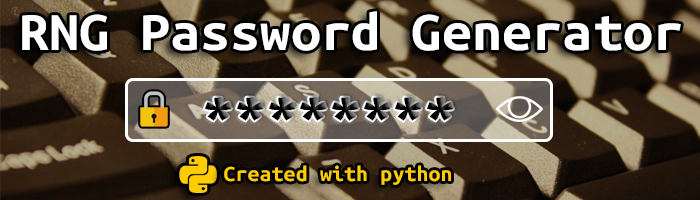

<center></center>

<br /><br />


<center><h1>🔐 RNG Password Generator</h1>

[](https://)
[](https://)
[](https://)
[](https://dev.to/kurtissfrost)
</center><br /><br />

# Useful Links:

- <h2><a href = "mailto:admin@kurtissfrost.com?subject=[🐞 Bug Report] RNG Password Generator">🐞 Bug Report</a></h2>
- <h2><a href = "mailto:admin@kurtissfrost.com?subject=[💻 Contributing] RNG Password Generator">💻 Contribute to the Project</a></h2>

<br /><br />

# What is it? 

This script will let you input a website that you want to generate a password for and then it will generate you a random 16 character length password using upper & lower case letters, numbers, and symbols and save it to a **.txt** file in the directory you have the **.py** file in.<br /><br />

# Language used & Goals:
Python was used to create this entire project. This is a living beginner project that I will try and work on and expand as I learn more about python. Right now, it is very simple project but, as I learn more about python, I want to develop this out a little more and add more features and functionality as I go.
<br /><br />

# Future Updates:
Since this is a living document, I am going to try my best to integrate new features as I learn more about python. A few features I am looking to include are:

- The ability to specify if your password is generated with numbers and special characters. Some websites and applications do not allow you to use special characters and numbers. So giving the user a prompt to see if they want to generate a password with those would be useful.<br /><br />
- The ability to specify the length of your password. (between 8 and 16 characters)
- Make a GUI for the application

  

<br /><br />

# Project Background:
Think of this as a "living project". As it stands right now, this is an early build and feature will be added as I learn more about Python. This is a learning project and as I learn more, I want to expand upon it.

<br />

# How does it work?

You launch the file and it will generate a 16 character long password for you. There are quite a few ways you can go about doing this.

* Launch it through the linux terminal by using <b><i>cd</b></i> to change your working directory to where you have downloaded the project. Then it's just a matter of running<br /><br />


```
python 3 RNG_Password.py
```

<br />
You can launch it through the Windows <b><i>cmd (command prompt)</b></i> Which is almost the same process. You open the cmd and point it to the directory where you have the <b><i>RNG_Password.py</b></i> saved an input the following:<br /><br />

``` 
python 3 RNG_Password.py
```
<br />
You can also run it through your code editor of choice (Pycharm, VS Code, etc.)
<br /><br />


# Contributions Welcome:
Got a feature you want implemented? Got your own idea about how the codebase is written? Submit a pull request, make a fork, or clone it.  All contributions are welcome all I ask is when contributing to this repository, please first discuss the change you wish to make via issue or email before making a change.
<br /><br /><a href = "mailto:admin@kurtissfrost.com?subject=RNG Password Generator(🤝🏻Contributing to the project)">🤝🏻 Contribute to the Project</a><br /><br />

# Bug Reporting:
Any weird bugs can be reported here by opening an issue or you can email me at <a href = "mailto:admin@kurtissfrost.com?subject=RNG Password Generator(🐞 bug report)">
admin@kurtissfrost.com</a><br /><br />

---
<br/>
<a href="https://www.buymeacoffee.com/frostkurti0z"></a></img>


